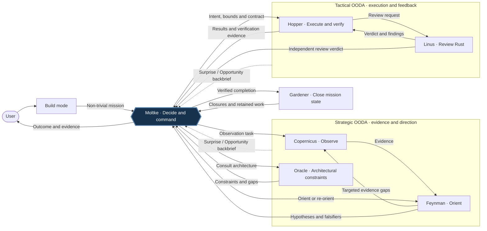

# OODA Loop Agents for opencode

**Nine subagents**: five OODA-phase agents (`copernicus`, `feynman`,
`moltke`, `hopper`, `linus`) plus four specialists (`gardener`,
`automaton`, `oracle`, `turbo`). Names are role mnemonics, not claims
about historical people or model behavior.

| Role        | Agent        | Responsibility                                                                            |
|-------------|--------------|--------------------------------------------------------------------------------------------|
| Observe     | `copernicus` | Gather cited evidence; no hypotheses                               |
| Orient      | `feynman`    | Rank hypotheses, name falsifiers, stress-test against examples             |
| Decide      | `moltke`     | Auftragstaktik / mission command — operations expert; sets intent, tasks subordinates      |
| Act         | `hopper`     | Execute scoped increments with verification                                                        |
| Act         | `linus`      | Rust-specialist review — idioms, unsafe soundness, cargo-audit/deny. Read-only on source; tactical feedback. |
| Specialist  | `gardener`   | Workspace cleanup after loop completes: closes bd mission epics, surfaces unfinished tasks                      |
| Specialist  | `automaton`  | Writes idiomatic Rust CLI tools to `scripts/` when control flow exceeds in-context budgets |
| Specialist  | `oracle`     | Surfaces architectural constraints from the repo's ADRs                                    |
| Specialist  | `turbo`      | Prompt rewriting via the P1–P12 activation recipe. Leaf-only; emits output, never in-place edits. |

## The two OODA loops



Solid arrows show tasking and routine feedback; dashed arrows show material
Surprise/Opportunity backbriefs. Moltke connects both loops, verifies outcomes,
and adjusts intent or decomposition; authorized local adaptation stays local.
Review is feedback within tactical OODA, not a third loop.

Supporting paths omitted for clarity: plan mode returns a written plan to the
user without execution; Automaton supplies scoped tools; Turbo emits prompt
rewrites. Material backbriefs from these specialists also route to Moltke.

Exactly two fleet loops pivot on moltke:

- **Strategic OODA** — Copernicus observes, Feynman orients, Oracle informs architectural constraints, Moltke decides intent and bounds. Closes on an actionable contract/package.
- **Tactical OODA** — Hopper executes/verifies, Linus reviews Rust, Moltke commands and independently checks results. Closes on verified completion or abandonment; surprise may reopen strategic work.

Hopper ↔ Linus review iteration is tactical feedback, **not a third OODA loop**.
Review labels, tiers and two repeat rejections on the same defect class remain
unchanged. Internal role workflows are not additional fleet loops.

## Mission command (Auftragstaktik)

**Moltke is the supreme commander** during a mission. The orchestrator
(build mode) hands off to moltke once for non-trivial work; moltke drives the
mission to completion. Moltke is the only role with authority to task any
agent directly during a mission, and the only role to which all subordinates
**back-brief** strategic shifts.

This is a local directed-opportunism adaptation informed by secondary
[Bungay book notes](https://www.lostbookofsales.com/notes/book-summary-art-of-action-by-stephen-bungay/)
(config-5de), not a verbatim historical protocol. Knowledge, alignment and
effects gaps motivate evidence, intent checks and verified feedback.

**Specialists** support these responsibilities on demand:

- `oracle` — consulted by moltke during the Decide phase when a decision
  touches architectural surface (data model, public API, cross-module
  contracts, deployment topology). Surfaces relevant ADRs and any tensions.
- `gardener` — invoked by moltke on package complete to close bd epics
  and surface retained-open beads. `.ooda/traces/` curation is the user's job.
- `automaton` — commissioned by any agent (most often hopper or copernicus)
  when a control-flow problem is too large for in-context solving (walking
  many files, deterministic transforms, graph traversals). Writes a small
  Rust CLI tool to `scripts/` and returns a tool description (purpose,
  inputs, output schema, exit-code semantics, performance envelope).
- `turbo` — leaf-only specialist for prompt rewriting via the P1–P12
  activation recipe (`opencode/turbo/prompt-activation-recipe.md`). Emits
  output as text or `.ooda/` artefact; never edits prompt files in place.

Linus is the tactical review counterpart to hopper; Oracle participates in
strategic work as an informational specialist, never a decision-maker.

**Back-briefs** report material Surprise/Opportunity affecting intent or bounds.
The canonical payload is in AGENTS.md § Back-brief protocol. Requested response
is a recommendation; Moltke decides. Routine friction and low-risk adaptation
stay local within authorized scope and budget, never silently expanding either.

## Plan mode vs build mode

Two opencode prompt modes orchestrate the agents differently:

- **Plan mode** is orient-only. Proceeds autonomously with named
  assumptions per the autonomy rule (loads `grill-me` only when the user
  explicitly invokes it: "grill me", "interview me", "stress-test"), then
  routes through `copernicus → feynman (→ oracle)` to produce a written
  plan as text output. Never edits source. Never dispatches moltke —
  moltke lives in build mode.
- **Build mode** drives both OODA loops through Moltke. Trivial → inline edit. Turbo
  prompt rewrites → `@turbo` directly. Everything else → `@moltke`, which
  authors the mission contract, drives tactical execution and Rust review
  feedback, and invokes gardener on
  MISSION/PACKAGE COMPLETE.

Build mode also accepts a plan-mode-produced plan as input: hand the plan
(file path, pasted body, or bd bead id) to moltke, which turns it into a
mission contract or package.

## Internal vs outer OODA

Each agent runs an internal observe→orient→decide→act loop inside its role
to close small problems without escalation. Trivial in-role tasks may be
closed by any agent without handoff. The outer multi-agent loop is reserved
for *strategic* concerns: multi-causal contention, multi-option decisions
under uncertainty, multi-file/irreversible work, cross-role gaps.

- `copernicus` — pure sensor. **No internal OODA, no hypotheses.** If
  evidence is thin, feynman re-tasks it with a sharper target.
- `feynman` — hypothesis-falsifier-stress-test cycle as its internal loop.
  Re-tasks copernicus when a falsifier needs evidence it cannot derive.
  Moltke can bounce orientation back if it is single-hypothesis or weakly
  falsified (strategy loop).
- `moltke` — internal observe→orient→decide loop over options; emits a
  single mission or a mission package. Persists as supreme commander
  through the whole mission.
- `hopper` — tightest internal loop (pre-flight → smallest increment →
  verify → next). Halts only on *surprise*. Always reports back to moltke,
  never directly to user.
- `oracle` — read-only ADR survey + tension report. No internal cycle
  beyond its single workflow.
- `linus` — Rust-specialist review along three axes (idioms, quality,
  security). Runs cargo check/clippy/test/audit/deny, registers a
  `review-report` evidence bead. Read-only; halts on pre-existing build
  break (Surprise).
- `automaton` — write tool, build, smoke-test, hand back tool path + run
  command + tool description.
- `gardener` — query bd mission/evidence beads, close completed epics,
  surface retained-open beads, report to moltke.
- `turbo` — single-pass rewrite + P1–P12 self-audit. No internal cycle
  beyond the recipe pass. Leaf-only; never re-tasks another agent.

## Decomposition by coupling (Moltke)

Moltke decomposes work by **coupling**, not by stakes:

- **Tightly coupled** (shared schema, single behaviour change, atomic
  refactor that cannot leave the tree green mid-way) → one mission.
- **Loosely coupled** (disjoint files, independent verifies, can each
  leave the tree green) → a **mission package**: 2–5 self-contained
  sub-missions, each with its own `success_criteria`, `[verify]` tiers,
  `abort_if`, `rollback_plan`. Hopper executes them in dependency order
  with **green checkpoints** between them. On sub-mission failure, only
  that sub-mission rolls back; prior greens stay; control returns to
  moltke (`package_rollback_strategy = "rollback_failed_only"`, the
  default).

Auftragstaktik scales recursively: every sub-mission specifies *what* and
*why*, not *how*.

## Communication style

All agent replies use **terse structured text with idiomatic Rust datatypes**.
The aim is signal density, not eloquence.

Prefer:

- Tagged unions (Rust enum variants) over adjectives:
  `Outcome::Verified { exit_code: 0 }` over "the test passed cleanly".
- Struct-shaped sections over paragraphs — fixed labelled fields the
  orchestrator can parse without reading prose.
- `Result<T, E>` framing over "it worked / it didn't".
- Tables for comparable data (options × cost × reversibility).
- Tab-separated tagged records for tool output (`MATCH\t<path>\t<line>`).

Avoid: banners, emoji decoration, adjective-heavy prose, restating the
question.

The handoff line and the back-brief format are themselves examples of the
style: fixed grammar, parseable, no decoration.

```
→ to: <agent|user> | status: <ready|blocked|needs-reloop|complete> | next_input: <one-line> | artefact: <bd-id|->

↑ back-brief to moltke
  trigger: <Surprise | Opportunity>
  scope: <OutsideMission | PackageLevel | SystemLevel>
  observation: <terse, cited>
  intent_relevance: <effect on intent or bounds>
  local_action: <action within authority, or none + reason>
  requested_response: <Acknowledge | AdjustIntent | ReDecompose | EscalateToUser>
  confidence: <high | medium | low>
```

## Design principles (the 12 baked in)

These are taken from Anthropic's published agent engineering, Simon Willison's
agentic-engineering patterns, and TDD-governance research on multi-agent code
generation.

1. **Goldilocks system prompts** — specific heuristics with flexibility, not brittle if-else, not vague waffle.
2. **Detailed delegation contracts** — each agent declares its required input fields and refuses if they're missing.
3. **Effort budget scales to complexity** — every agent has explicit tiers (trivial / standard / deep) with tool-call ceilings.
4. **Canonical few-shot examples** — every agent ends with at least one trivial and one complex worked example.
5. **Start broad, narrow down** — encoded in copernicus and feynman workflows.
6. **Just-in-time context via beads** — large evidence lives in the bd bead `description`; `.ooda/` is only the narrow escape hatch for bodies that genuinely cannot live in a bead, still bead-pointed. Handoffs pass the bead id (`bd-NNN`), not the body or path. Avoids the "telephone game" through the orchestrator.
7. **Compaction & note-taking** — moltke creates a bd epic per mission; hopper closes child task beads on verify-green; gardener closes the epic and surfaces retained-open beads when missions complete. Gardener does not prune `.ooda/` files.
8. **Token-efficient tool design** — automaton writes a Rust CLI rather than simulating a for-loop in tokens.
9. **End-state evaluation** — hopper's "Result vs intent" check is grounded in moltke's `success_criteria`, not adherence to prescribed steps.
10. **Interleaved thinking between tool calls** — feynman's stress-test loop and hopper's verify-after-each-step enforce this.
11. **Explicit effort ceilings** — `max_files_changed`, `max_tool_calls`, `max_wall_clock_minutes` in every moltke contract.
12. **Failure-mode awareness** — known anti-patterns are forbidden by name in each agent's Rules section (single-hypothesis orientation, unverified success claims, single-option "decisions").

## Assignment search readiness

`plugins/searxng.mjs` registers `search-readiness.mjs` on `chat.message`.
When `output.message.agent` resolves to `moltke`, the hook appends synthetic
`SearchReadiness: <Ready|Recovered|Degraded|Blocked> (<reason>)` text. It runs
at that message/assignment boundary, not on `chat.params` or every model turn.
Moltke consumes the status once and carries it through the assignment. Missing
status is unknown, not Ready. This does not change explicit search-tool policy:
research belongs to Copernicus/Feynman, not Moltke/Hopper.

| Status | Meaning / commander action |
|---|---|
| Ready | Functional probe returned at least one titled HTTP(S) result; research dispatch allowed, relevance not guaranteed. |
| Recovered | Existing owned resources recovered and functional retest passed. |
| Degraded | Empty upstream results, failed override/retest, or concurrent Busy; explicitly proceed degraded for non-research work. |
| Blocked | Unsafe endpoint, uncertain command outcome, failed identity/inspection or deadline; no unsafe recovery. |

For Degraded/Blocked/missing status, if research is load-bearing and no
authorized evidence path remains, Moltke reports blocked with the missing
capability rather than inventing evidence or expanding permissions.

**Bounds:** 60-second total cooperative deadline, 5-second probe deadline
including body reading, 1 MiB response payload, 32 KiB each command stdout and
stderr (64 KiB combined). One active operation per helper instance; concurrent
assignments receive Degraded Busy immediately, without a waiter queue. Command
timeout or output overflow latches uncertainty until plugin reload: no later
mutation is attempted. Killing a Podman client does not roll back daemon work.
These are admission limits and cooperative JS timers, not real-time or process
memory guarantees; transport chunks, buffer/JSON copies, runtime and kernel
memory are excluded.

**Recovery:** only with no nonempty `SEARXNG_ENDPOINT` override, using default
`http://localhost:19217/search`. Inspect the existing `searxng` machine and its
explicit connection identity; start a stopped machine at most once and recheck
fresh metadata. Validate existing container name, image, full ID and sole
`127.0.0.1:19217 → 8080/tcp` mapping. Use `podman -c searxng` and the pinned
container ID to start or restart once, then one functional retest. Missing,
ambiguous or wrong-owned resources block; never create/init/run/replace/remove
resources or call the destructive local `start.sh`. Empty results do not
trigger recovery.

**Overrides:** credential-free HTTP(S) `localhost`/`127.0.0.1` endpoints only,
probe-only even when explicitly set to the default URL. Public HTTPS, IPv6 and
other spellings are rejected before probing. This conservative helper subset
does not redefine the existing explicit search tool's endpoint validation.

**Evidence and limits:** config-8ea records mocked recovery, targeted tests and
a live read-only functional probe. Cold-service recovery was not exercised.
Actual post-restart Task/direct/API assignment and synthetic-message delivery
remain **unverified**. Quit and restart opencode after prompt/plugin edits;
running sessions retain startup bindings. Confirm the received status and trace
before claiming a specific invocation path is integrated. Local checks are
`node --test opencode/search-readiness.test.mjs` from repo root and
`opencode debug config`; neither proves post-restart delivery by itself.

## Conditional tools

Some agents depend on capabilities that may or may not be available.
Probe before using; fall back gracefully.

- **`grill-me`** — opencode skill (loaded via the `skill` tool), used by
  plan mode **only when the user explicitly invokes it** ("grill me",
  "interview me", "stress-test the plan"). Opt-in, not the default
  intent-confirmation path. When triggered but the skill is not listed in
  `<available_skills>`, falls back to inline clarification per the autonomy
  rule.
- **`adr-fmt`** — CLI tool used by oracle to enumerate and read ADRs. Probe
  with `command -v adr-fmt`. Falls back to direct markdown reads from
  standard locations (`docs/adr/`, `doc/adr/`, `adr/`, `architecture/adr/`).

Agents state which mode they ran in (capability-available vs. fallback) so
the caller knows whether output reflects authoritative tooling or a
best-effort scan.

## The `.ooda/` directory

`.ooda/` is gitignored tracing plus the narrow escape hatch for local outputs
and bodies that genuinely cannot live in a bd bead. Cross-agent observations,
orientation, mission contracts, journals, and oracle summaries live in bd bead
`description` fields by default. If cross-agent material is staged under
`.ooda/`, it still needs a bead pointer; handoffs pass `bd-NNN`, never the file
path. Gardener does not delete `.ooda/` files; users curate traces and local
artefacts.

```
.ooda/
├── traces/<date>/<session>.jsonl    # Tracer plugin output
├── turbo-<slug>-<ts>.md             # User-facing prompt rewrites
├── review-<ts>.md                   # Generic code-review reports
└── PRDs/<slug>.prd.md               # User-facing PRDs
```

```sh
echo ".ooda/" >> .gitignore
```

Task hygiene lives in bd: any task list, sub-mission, or checklist an agent
creates is represented by beads and closed (`bd close <id> --reason ...`) the
moment it finishes. Gardener closes mission epics only when child beads are
closed and surfaces retained-open beads back to moltke.

## The `scripts/` directory (automaton's workspace)

Automaton bootstraps `scripts/` lazily on first invocation. Single cargo
workspace, one binary per tool:

```
scripts/
├── Cargo.toml              # workspace + shared deps
├── Cargo.lock
└── src/
    └── bin/
        ├── find-orphan-tests.rs
        └── count-todos.rs
```

Run a tool: `cargo run --manifest-path scripts/Cargo.toml --bin <tool> -- <args>`.

Tool style: idiomatic Rust enums for outcomes/errors, `.expect("informative
message")` for error handling (panics carry the diagnostic), `std::env::args()`
for simple CLIs (clap only when justified), tab-separated tagged records to
stdout, deterministic output (sort when iteration order matters).

## Installation

```sh
# user-level (all projects)
cp agents/*.md ~/.config/opencode/agents/
cp prompts/*.md ~/.config/opencode/prompts/
cp AGENTS.md ~/.config/opencode/

# or project-level
mkdir -p .opencode/agents && cp agents/*.md .opencode/agents/

# optional tracing / escape-hatch artefact directory
mkdir -p .ooda && echo ".ooda/" >> .gitignore
```

## Usage

### Plan mode (orient only; produces a written plan)

```
> @plan migrate the event store from JSON to a binary format
```

Plan mode proceeds with named assumptions (loads `grill-me` only on explicit user invocation), then routes:

1. **copernicus** — gather evidence at the right tier. Returns inline summary + evidence bead id when large. If thin, expect a re-task from feynman.
2. **feynman** — produce ranked hypotheses with falsifiers, stress-test the leader, name remaining unknowns. Re-task copernicus rather than guessing.
3. **oracle** — optional, when architectural surface is touched: ADR summaries, binding constraints, gaps.
4. Plan mode writes the plan (goal, evidence, options, stakes, success criteria, risks, open questions) and hands it back. The user takes it to build mode for execution.

### Build mode (full OODA loop; default for non-trivial work)

```
> @build fix the off-by-one in list_orders pagination
```

Build mode picks one of:

```rust
enum BuildAction {
    InlineEdit,                              // single edit, no tradeoffs
    InvokeMoltke { brief: MissionBrief },    // default for non-trivial; moltke drives end-to-end
    InvokeTurbo { source: PromptSource, surface: Surface }, // prompt-rewriting request
    ExecutePlan { plan_ref: PlanRef },       // plan-mode artefact → moltke turns into contract
    AskUser { question: &'static str },      // medium+ risk only
}
```

For plan-mode-produced plans:

```
> @build execute plan in bd-60
```

### Single phase (rare; advanced)

```
> @copernicus tier=moderate observe the websocket reconnect machinery
> @feynman depth=standard orient on observations bead bd-55
> @moltke decide between revert vs patch — orientation in the previous message
> @hopper execute mission package bd-60
> @oracle survey ADR coverage of the event-store storage layer
> @linus review the unsafe blocks in crates/ffi/
> @automaton write a tool to find every .rs file whose tests block lacks #[cfg(test)]
> @gardener clean up after package rename-getcwd-1730300000
> @turbo rewrite my draft prompt for claude-opus with .ooda/ artefact output
```

### What good looks like

- Copernicus reports include `Tool calls used: 8/15` and a non-empty `Unobserved (gaps)`. Re-tasks are first-class, not failure.
- Feynman reports always have ≥ 2 hypotheses with falsifiers, a stress-test walk-through, and (when needed) an explicit re-task brief to copernicus.
- Moltke contracts always have a pre-mortem, `rollback_plan`, and a one-sentence **coupling judgement**. Oracle is consulted (or explicitly skipped with reason) when architectural surface is touched.
- Hopper's `Result vs intent` is backed by an exit-0 verify command, not vibes. Every mission has bd child tasks; sub-missions are closed when their `verify.mid` goes green.
- Gardener reports clean bd-state GC outcomes (`closed_epics: [...]`, `retained_open_beads: [...]`) per package; back-briefs accumulating retention as a system-level signal.
- Automaton always returns a tool description (purpose / inputs / output schema / exit codes / determinism / performance) alongside the run command.

## Role discipline (doctrine, not permissions)

All subagents share hopper's permission matrix — this is for **tempo**, not
role-creep. The role separation is doctrinal:

- `copernicus` observes (no hypotheses, no decisions).
- `feynman` orients (no decisions, no execution).
- `moltke` decides and commands.
- `hopper` executes (verify-before-claim).
- `linus` reviews Rust code (read-only; no edits, no decisions).
- `oracle` informs about architecture (no decisions).
- `automaton` builds tools (no business logic).
- `gardener` closes bd state (never edits the working tree or deletes files).

An agent stepping outside its role is a doctrine violation even though the
permission allows it. Trivial in-role tasks may be closed without escalation.

## Custom commands (`opencode/commands/`)

Twelve slash commands are available in `opencode/commands/`. Invoke them with `/command-name` in opencode:

| Command | File | Purpose |
|---------|------|---------|
| `/prime` | `commands/prime.md` | Session context priming — loads AGENTS.md, git log, project layout, open missions |
| `/create-prd` | `commands/create-prd.md` | 15-section PRD generator; output to `.ooda/PRDs/<slug>.prd.md` |
| `/create-rules` | `commands/create-rules.md` | AGENTS.md generator for new projects (refuses if AGENTS.md exists) |
| `/validate` | `commands/validate.md` | Multi-toolchain build/lint/test (Cargo/npm/pnpm/uv/go); inline tabular output |
| `/understand*` (8) | `commands/understand.md`, `understand-chat.md`, `understand-dashboard.md`, `understand-diff.md`, `understand-domain.md`, `understand-explain.md`, `understand-knowledge.md`, `understand-onboard.md` | Thin wrappers over the matching `understand` skills: knowledge-graph generator; KG Q&A; launch KG web dashboard; analyze git diff/PR; business-domain flow graph; deep-dive file/function explainer; wiki knowledge-graph generator; onboarding guide generator |

## File map

```
.config/opencode/
├── README.md                    (this file)
├── AGENTS.md                    Shared orchestration rules; auto-loaded into every mode
├── opencode.json
├── agents/
│   ├── copernicus.md            Observe — pure sensor, owns external research
│   ├── feynman.md               Orient — ranked hypotheses + falsifiers + stress-test
│   ├── moltke.md                Decide / supreme commander — mission command, two-loop owner
│   ├── hopper.md                Act — verify-before-claim execution
│   ├── gardener.md              Garbage collect — close completed bd epics
│   ├── automaton.md             Specialist — Rust CLI tool-builder for scripts/
│   ├── oracle.md                Specialist — ADR-driven architectural guidance
│   ├── linus.md                 Act — Rust-specialist code reviewer (read-only)
│   └── turbo.md                 Specialist — prompt rewriter (P1–P12 recipe)
├── turbo/
│   └── prompt-activation-recipe.md   P1–P12 recipe; single source of truth for turbo
├── plugins/
│   ├── graphify.js              Injects a knowledge-graph reminder before bash calls when graphify-out/ exists
│   ├── searxng.mjs              Web search tool + Moltke chat.message readiness hook
│   └── tracer.mjs               Session trace writer → .ooda/traces/
├── skills/
│   ├── agent-browser/SKILL.md   Browser automation (probe-then-fallback)
│   ├── code-review/SKILL.md     Generic code review (standard | security modes)
│   ├── graphify/SKILL.md        Knowledge-graph build + query over any codebase
│   ├── grill-me/SKILL.md        Stress-test plans by interview
│   ├── obsidian-second-brain/SKILL.md  Read-only navigation of a PARA-style Obsidian vault
│   ├── quality-sweep/SKILL.md   29-dimension SDLC quality sweep → HTML report
│   └── wayfinder/SKILL.md       Plan oversized work as bd decision tickets
├── search-readiness.mjs          Bounded assignment probe + existing-resource recovery
├── search-readiness.test.mjs     Targeted helper tests; recovery simulated
├── package.json                 Pins @opencode-ai/plugin SDK (currently 1.17.15)
├── package-lock.json            Lockfile; tracked
├── commands/                    Custom slash commands (invoke with /command-name)
│   ├── prime.md                 /prime — session context priming via copernicus
│   ├── create-prd.md            /create-prd — 15-section PRD generator → .ooda/PRDs/
│   ├── create-rules.md          /create-rules — AGENTS.md generator for new projects
│   ├── validate.md              /validate — multi-toolchain build/lint/test runner
│   ├── understand.md            /understand — knowledge-graph generator
│   ├── understand-chat.md       /understand-chat — knowledge-graph Q&A
│   ├── understand-dashboard.md  /understand-dashboard — launch KG web dashboard
│   ├── understand-diff.md       /understand-diff — analyze git diff / PR
│   ├── understand-domain.md     /understand-domain — business-domain flow graph
│   ├── understand-explain.md    /understand-explain — deep-dive file/function explainer
│   ├── understand-knowledge.md  /understand-knowledge — wiki knowledge-graph generator
│   └── understand-onboard.md    /understand-onboard — onboarding guide generator
└── prompts/
    ├── plan.md                  Plan mode — orient-only, read-only on the tree; never dispatches moltke; grill-me opt-in
    └── build.md                 Build mode — owns the full OODA loop; hands off to moltke
```

## References

- Anthropic — *How we built our multi-agent research system*: <https://www.anthropic.com/engineering/built-multi-agent-research-system>
- Anthropic — *Effective context engineering for AI agents*: <https://www.anthropic.com/engineering/effective-context-engineering-for-ai-agents>
- Simon Willison — *Subagents (Agentic Engineering Patterns)*: <https://simonwillison.net/guides/agentic-engineering-patterns/subagents/>
- Boyd's OODA loop: <https://en.wikipedia.org/wiki/OODA_loop>
- Moltke & Auftragstaktik: <https://en.wikipedia.org/wiki/Helmuth_von_Moltke_the_Elder>
- Stephen Bungay — *The Art of Action*, via [secondary book notes](https://www.lostbookofsales.com/notes/book-summary-art-of-action-by-stephen-bungay/); fleet schema is a local adaptation.
- Feynman Technique: <https://fs.blog/feynman-technique/>
- Klein pre-mortem: <https://hbr.org/2007/09/performing-a-project-premortem>
- ADR (Architecture Decision Records): <https://adr.github.io/>
